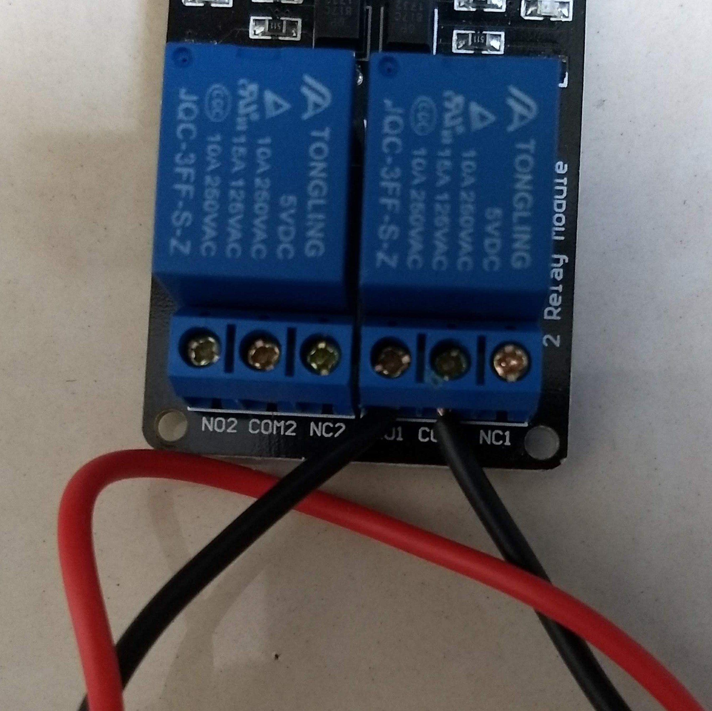
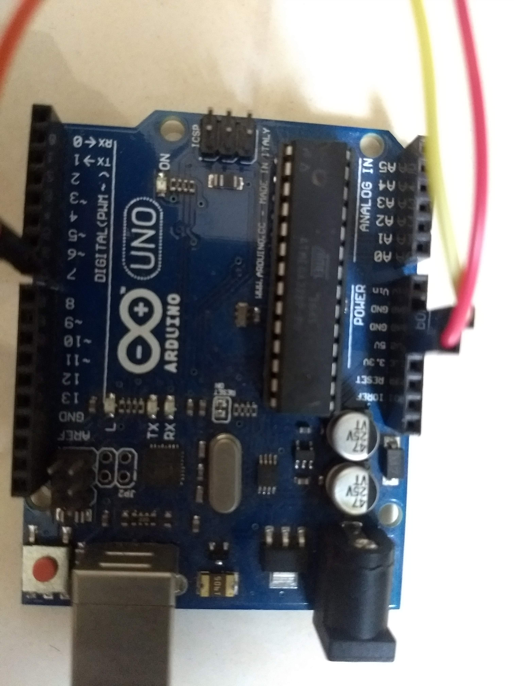
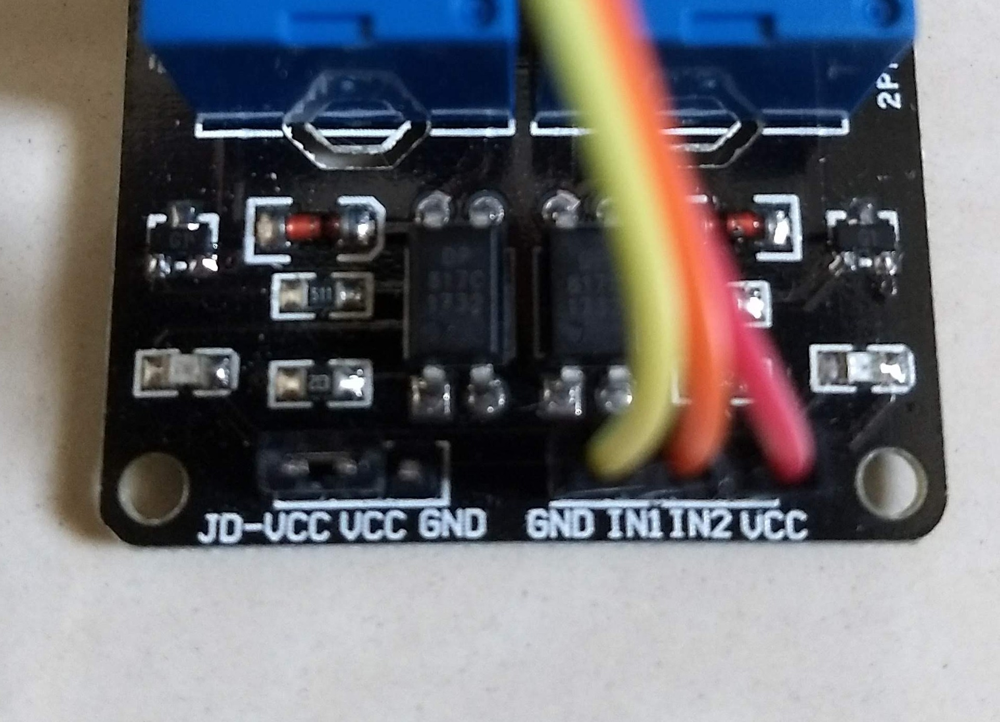
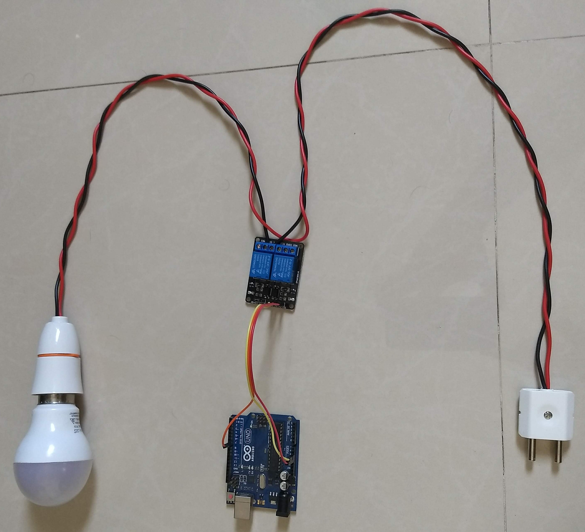

# Components & Connections


## Components Used

 1. Arduino UNO board
 2. 5V, 10A 2 Channel Relay Switch
 3. Power supply for the Arduino board
 4. Male-to-Female connector wires
 5. Wires (For Electrical Device Connection)

## Connections

### Electrical Device to Relay
****Since this is the First and basic setup, we used a LED bulb to test the setup and not an electrical device immediately.***
****The setup should work with any Electrical device which operates in the range supported by the Relay. But we would recommend taking baby steps***

1. The Relay is preferably connected to the NEUTRAL supply of the Device. If you are not able to identify this, not to worry.
2. Cut the Wire and connect one end into the **COM1** and second end into the **NO1** point of the Relay.
```
	NO1 -> Normal Open of Relay 1
	COM1 -> Common of Relay 1
	NC1 -> Normal Closed of Relay 1
```


### Arduino to the Relay
1. Make following connections:
	GND --> GND
	5V Power --> VCC
	Digital 7 --> IN 1






## Final Setup



